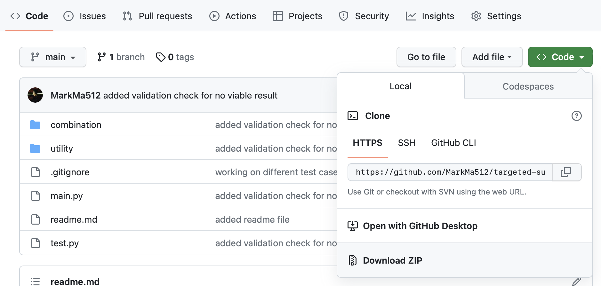
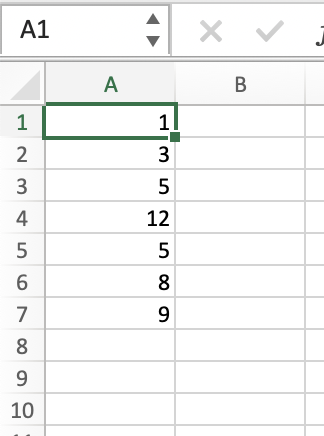
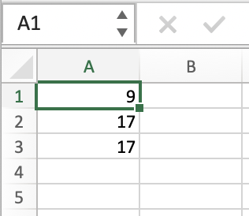
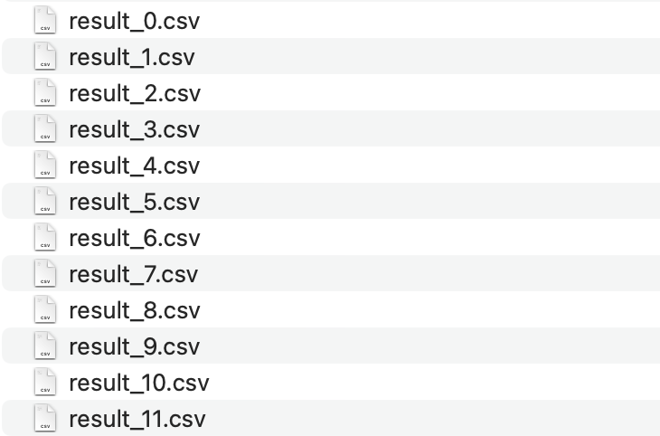

# Targeted Sum

## About the Project
Some of my accountant friends shared with me that a common task they had to do is to figure out which of the transactions in a list of transactions add up to a targeted sum. More than often, they have to do this manually and it was extremely tedious, time consuming and error prone, and I see this as a good use case for the targeted sum problem. 

Thus, I have developed this mini-project is to help them to do their work more efficiently by automating this task leveraging on the backtracking algorithm.

### Built With

* [Python 3.10](https://www.python.org/)

No additional libraries are required.

### Project Structure

`utility': contains utility functions, such as csv file reader/writer and validation functions
`combination': contains functions to generate the combinations for the targeted sum
`media`: folders to store media files, such as images and videos
`main.py': main program
`test.py': testing the program for different inputs and target scenarios

### Algorithms 

## Getting Started 

### Prerequisites

1. Ensure that you have Python 3.10 installed on your machine. 
    - For Windows users, you can download the latest version of Python from [here](https://www.python.org/downloads/windows/).
        - You can refer to this [video](https://www.youtube.com/watch?v=0QibxSdnWW4) for a step-by-step guide on how to install Python on Windows. 
    - For Mac users, Python is pre-installed on your machine. However, if you are using an older version of Mac OS, you can download the latest version of Python from [here](https://www.python.org/downloads/mac-osx/).
        - You can refer to this [video](https://www.youtube.com/watch?v=NmB1AwF3G3k) for a step-by-step guide on how to install Python on Mac OS.

### Installation

1. You can download the project as a zip file and unzip it on your machine by clicking on the green "Code" button on the top right corner of the project page, shown as below:
    
2. Alternatively, you can clone the project to your machine by running the following command in your terminal:
    ```sh
    git clone https://github.com/MarkMa512/targeted-sum.git
    ```
3. Once you have downloaded the project, prepare your input as a column in Excel, shown as below, save it as `input.csv` in the targeted-sum folder. 
    

4. Prepare your target as a column in Excel, shown as below, save it as `target.csv` in the targeted-sum folder. 
    
5. Launch your terminal / command prompt. 
    - For Windows users, you can launch your command prompt by pressing `Windows + R` and type in `cmd` in the pop-up window.
    - For Mac users, you can launch your terminal by pressing `Command + Space` and type in `terminal` in the pop-up window.

6. Navigate to the targeted-sum folder: 
    - For Windows users, you can type in the following command in your command prompt, then press `Enter`:
        ```cmd
        cd <drag and drop the targeted-sum folder here>
        ```
    - For Mac users, you can type in the following command in your terminal, then press `Enter`:
        ```sh
        cd <drag and drop the targeted-sum folder here>
        ```

7. Run the following command in your terminal / command prompt:
    ```sh
    python main.py
    ```
    or 
    ```sh 
    python3 main.py
    ```
8. The solution will be saved as `result_n.csv`, for n numbers of viable combinations. If there are more than one viable combinations, the solution will be saved as `result_1.csv`, `result_2.csv`, `result_3.csv`, and so on, shown as below:
    

    If there is no viable combination, a warning message will be printed in the terminal / command prompt: 

    > 2023-05-10 15:06:01 INFO test.py:test():20: =====validating input and target=====
    > ...
    > 2023-05-10 15:06:01 INFO test.py:test():29: =====validating result=====
    > 2023-05-10 15:06:01 INFO validation.py:validate_viable_result_sets():112: ---validating viable result sets---
    > 2023-05-10 15:06:01 INFO validation.py:validate_viable_result_sets():114: ---0 viable result sets found---
    > 2023-05-10 15:06:01 ERROR validation.py:validate_viable_result_sets():116: +++viable result sets is empty!+++
    > 2023-05-10 15:06:01 INFO validation.py:validate_viable_result_sets():117: ===No viable combination found===
    
    The combination will also be printed in the terminal / command prompt. 
    > 2023-05-10 15:08:17 INFO validation.py:validate_result():70: ---validating result---
    > 2023-05-10 15:08:17 INFO validation.py:validate_result():108: ===result is valid===
    > 2023-05-10 15:08:17 INFO main.py:main():46: ---result 5 is valid---
    > [[1, 8], [3, 5, 9], [5, 12]]
    > 2023-05-10 15:08:17 INFO csv.py:export_to_csv():26: ---exporting to result_5.csv---

### Usage 

## Road Map

[x] 1. Calculate targeted sum for a input list of unique integers to another list of unique integers as target. 
[x] 2. Calculate targeted sum for a input list of non-unique integers to another list of non-unique integers as target. 
[x] 3. Calculate targeted sum for a input list of non-unique integers to another list of non-unique integers as target, for both positive and negative integers
[ ] Calculate targeted sum for a input list of non-unique integers to another list of integers as target, for both positive and negative integers, and zeros 
[ ] Expose the program as a REST API
[ ] Expose the program as a web application
